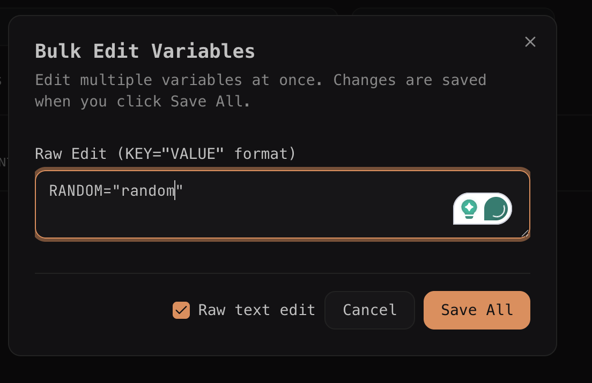

- [x] move the dashboard to dedicated route `/dashboard`.
- [x] update the sidebar with the correct functionality, log out button, and settings button and profile, along with correct user info.
- [x] do we need a profile page? what is even the use case for it? (Created at /profile)
- [ ] in `handleReveal` and `handleCopy` are we re-calculating the decrypted value every time? for each value? if yes, then we should cache it in state or fix it such that once we unlock the passcode, we don't need to decrypt the same value again.
- [ ] **Project Passcode Rotation**: Currently, changing a project's 6-digit passcode is not allowed.
  - **Reasoning**: It is a high-cost operation. Changing the passcode changes the PBKDF2 derived key, which would require re-encrypting EVERY variable in EVERY environment for that project, as well as re-encrypting all shared passcodes in the `sharedSecrets` table.
  - **Implementation Note**: If implemented, it must be performed as a client-side batch job (decrypt with old key, re-encrypt with new key) with a progress indicator and warning to the user.
- [ ] option to remove environments, only allowed to Owners, but Admin can create new Environment, but can't delete them. (also need to check if those vars are shared or not)
- [ ] add length limit to description field and other such fields in schema.
- [ ] update the enums such as "admin" and "member" to be "owner" and "member" in react files to types directly from convex.
- [ ] when removing a env key, instead of the alert we should get a dialog telling us the name and the environment where the key is used, which will get deleted.
- [ ] remove mutation in variable.ts `const variable = await ctx.db.get(args.id);` why are we querying the whole db again, instead of that specific table?
- [ ] Transfer ownership of project, pending.
- [ ] more options like select all, select none, and select few in shared section in dashboard to perform bulk actions, disable, expire, delete.
- [ ] add toast notifications for successful actions, ex: copy, delete, etc.
- [x] Implement user roles (e.g., `user`, `pro`, `pro_plus`, `super_admin`) in the user table to control feature access, such as limiting project creation (5 or 10), environment count (3 or 5), and members per project (2 or 5). (Implemented in `convex/lib/roleLimits.ts`)
- [ ] remove the demo routes and data, but add the learning and knowledge base to the docs (learning.md).
- [ ] when the / loads, initially there is no sign in , get started and get started free button, they appear after a delay most probably network call to the clerk server, instead of waiting for the response and showing nothing add a suspense component to show get started, sign in until we get the response if we get user is logged in, we will just update the component in place else it will stay the same, just not via the suspense component.
- [ ] there is a bug in variable naming in the dashboard, it always show the name of the var in CAPITAL, whether the actual name is small or capital.
- [ ] update the toast ui.
- [ ] if a user created more that 3 projects, while he was on pro plan, and later on he degrades to free plan, he will still have those extra privileges, how to fix that?
- [ ] re-check save mutation throughly in @convex/variable.ts, seems something is wrong there.
- [ ] update platformRole to tier in the user table, and update the UI accordingly.
- [ ] update the field in per environment so that it shows in UI the last updated by User (who updated the env vars last)
- [ ] check if Bulk add dialog and Bulk edit dialog can use a common logic instead of duplicating the code.
- [ ] raw text edit mode should be on left side 

---

- [ ] before going prod, [configure Google social connection in Clerk](https://clerk.com/docs/guides/configure/auth-strategies/social-connections/google)
