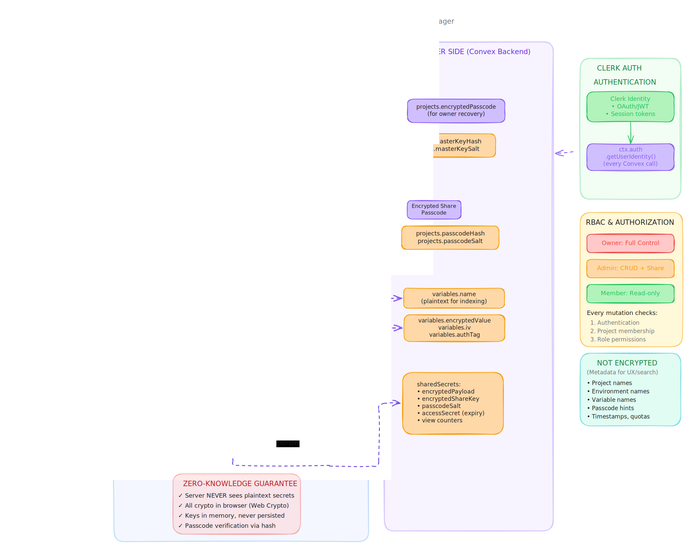

# Tijori Architecture

> Last Updated: May 17, 2026

## Overview

Tijori is a zero-knowledge environment variable manager built with TanStack Start, React, Convex, Clerk, Tailwind CSS, Nitro, and Bun.

Secret values are encrypted and decrypted in the browser with the Web Crypto API. Convex stores encrypted payloads plus the metadata needed for collaboration, search, sharing, quotas, and authorization.

Project passcodes are the main exception to the "browser-only" rule: on unlock, the entered passcode is sent to Convex only so the server can verify it against a stored salted hash. The plaintext passcode is not persisted.



## Runtime Boundaries

| Layer | Responsibility |
| --- | --- |
| Client (`src/`) | UI, key derivation, encryption/decryption, passcode entry, decrypted state |
| Convex (`convex/`) | Auth, RBAC, schema, passcode verification, share lifecycle, quotas |
| Clerk | Identity, sessions, JWTs |
| Nitro (`server/`) | Response security headers |

## Core Design Rules

- Secret values are never decrypted on the server.
- Derived project keys live in memory only via `src/lib/key-store.ts`.
- Convex functions authenticate first, then re-check project membership and role.
- Metadata required for product behavior is not treated as secret-value data.

## Key Hierarchy

```text
Master key (user-entered)
  -> salted hash stored on users for verification
  -> PBKDF2(masterKey, project.passcodeSalt)
  -> encrypts the project's 6-digit passcode for owner recovery

Project passcode (6 digits)
  -> salted hash stored on projects for server-side verification
  -> PBKDF2(passcode, project.passcodeSalt)
  -> project CryptoKey used for variable encryption and share-passcode recovery

Share passcode (8+ alphanumeric)
  -> PBKDF2(sharePasscode, sharedSecrets.passcodeSalt)
  -> decrypts a random ShareKey
  -> ShareKey decrypts the shared payload
```

## What Is Encrypted

| Data | Storage Pattern | Notes |
| --- | --- | --- |
| User master key | Not stored | Only `users.masterKeyHash` and `users.masterKeySalt` are stored |
| Project passcode | Salted hash + encrypted copy | `projects.passcodeHash` verifies unlocks; `encryptedPasscode` supports owner recovery |
| Variable values | Encrypted blob + IV + auth tag | Stored in `variables` |
| Share payload | Encrypted blob + IV + auth tag | Stored in `sharedSecrets.encryptedPayload` |
| ShareKey | Encrypted with share passcode | Stored in `sharedSecrets.encryptedShareKey` |
| Share passcode | Encrypted with unlocked project key | Lets creators recover/view it later without storing plaintext |

## What Is Not Encrypted

These fields are still sensitive, but they are not treated as secret-value ciphertext:

- Project names, descriptions, and passcode hints
- Environment names and descriptions
- Variable names
- Membership roles
- Timestamps, quota counters, expiry data, and share view counts
- Account status and plan metadata

## Main Flows

### Project Creation And Unlock

1. The user configures a master key. Tijori stores only a salted verifier on the `users` record.
2. When creating a project, the browser generates `passcodeSalt`, hashes the 6-digit passcode, derives a recovery key from the master key, and encrypts the passcode before writing the project.
3. On unlock, Convex verifies the entered passcode against `projects.passcodeHash`.
4. If verification succeeds, the browser derives the project key from the passcode and stores it in the in-memory `keyStore`.

### Variable Storage

1. Variable names stay plaintext for indexing and UX.
2. Variable values are encrypted client-side with the project key.
3. Convex stores only ciphertext plus IV and auth tag.

### Share Creation And Access

1. An owner or admin decrypts selected variables in the browser.
2. The browser generates a random ShareKey and encrypts the payload with it.
3. The browser derives a key from the share passcode and encrypts the ShareKey.
4. The browser also encrypts the share passcode with the unlocked project key so the creator can recover it later.
5. Public share access uses `sharedSecrets.accessSecret` to enforce expiry and view limits atomically, then the browser decrypts the ShareKey and payload locally.

Share passcodes are not server-verified. Successful client-side decryption is the proof that the passcode is correct.

## Data Model

- `users`: Clerk-linked profile, master key verifier, account and tier state
- `projects`: project metadata, passcode verifier, encrypted project passcode, owner
- `projectMembers`: per-project RBAC
- `environments`: named environments inside a project
- `variables`: plaintext variable name plus encrypted value
- `sharedSecrets`: encrypted share artifacts, expiry, disable state, and view counters
- `quotas`: per-project resource tracking
- `deletionJobs`: async account deletion tracking

## Security-Sensitive Files

- `src/lib/crypto.ts`
- `src/lib/key-store.ts`
- `convex/schema.ts`
- `convex/projects.ts`
- `convex/sharedSecrets.ts`
- `server/middleware/security-headers.ts`

## Companion Docs

- [Docs Index](./DOCS.md)
- [Security](./SECURITY.md)
- [Privacy](./PRIVACY.md)
- [Historical implementation plan](./init.md)
- [Working notes and learnings](./learning.md)
